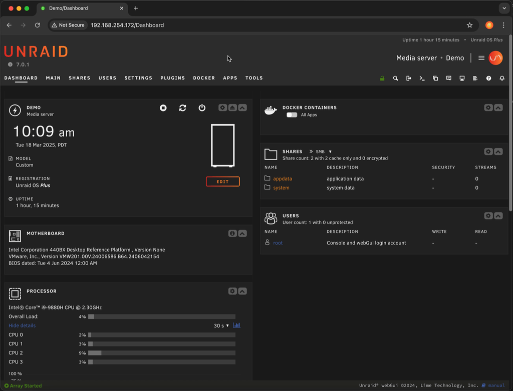
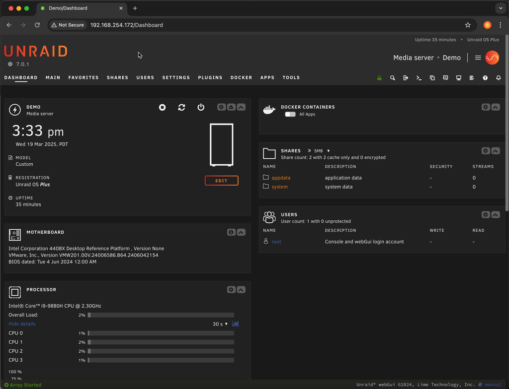
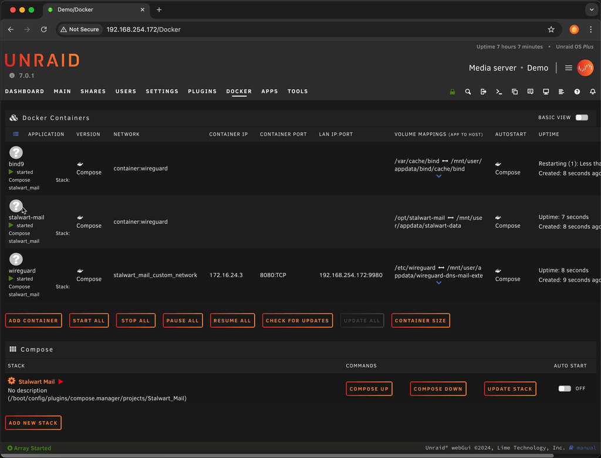

# Step 4 - Deploy containers for Wireguard, Stalwart, and BIND

We can now deploy the Stalwart mail server and BIND 9 containers to host our DNS and email, along with WireGuard to proxy the connections from the Internet through the Elastic IP in AWS.

:::note
If you prefer to manage DNS outside of the stack you can remove the `bind9` service from the docker compose yaml and skip the configuration section.
:::

## Install docker compose manager plugin for Unraid

Using docker compose on Unraid requires the installation of the [Docker Compose Manager plugin](https://forums.unraid.net/topic/114415-plugin-docker-compose-manager/). Once [community applications](https://forums.unraid.net/topic/38582-plug-in-community-applications/) is installed you can  click on the `apps` tab, search for `docker compose manager` and install it.

<details>
<summary>
Unraid plugin installation example
</summary>


</details>

After installation we can create the stack which will launch the WireGuard VPN
Client, the BIND 9 DNS server, and the Stalwart Mail Server containers.

## Launch the Stalwart Mail docker compose stack

We launch the stack to create the appropriate directories and pull down the
docker images.

1. Click the `plugins` tab
1. Click the `Compose Manager` plugin icon
1. Click the `Add New Stack` button
1. Enter `Stalwart Mail` in the `Stack Name`
1. Click the `Cog Icon` next to `Stalwart Mail` stack
1. Choose `Edit Stack` / `Compose File`
1. Paste the contents of [the project docker compose for unraid file](https://github.com/markfalk/stalwart-mail-wgproxy/blob/main/docker-compose-unraid.yml) into the textbox replacing the `services:` line
1. Click `Save Changes` button at the top / Click `Ok` to the `Edit Stack UI Labels` section
1. Click the `Compose Up` button next to the stack to create the containers.

<details>
<summary>
Docker compose create stack example
</summary>

</details>

:::important
Record the admin password by viewing the logs

1. Click the `Dockers` tab
1. Click the icon for the `stalwart-mail` container and choose `logs`
1. Record the password shown

<details>
<summary>
Stalwart admin password example
</summary>

</details>

:::

Shut down the stack using the *Compose Down* button. We will update the configurations while the stack is down.

## Create the WireGuard configuration to connect Unraid to the WireGuard server running in AWS

Copy the template from [the project template file](https://github.com/markfalk/stalwart-mail-wgproxy/blob/main/wg-conf/wg0.conf.client-template) to `/mnt/user/appdata/wireguard-dns-mail-external/wg0.conf`

Using an editor of your choice update it with the public AWS EIP, wireguard client private key, and wireguard server public key.

```bash
cp wg-conf/wg0.conf.client-template /mnt/user/appdata/wireguard-dns-mail-external/wg0.conf
vi /mnt/user/appdata/wireguard-dns-mail-external/wg0.conf
```

<details>
  <summary>Example /mnt/user/appdata/wireguard-dns-mail-external/wg0.conf</summary>

```txt
[Interface]
  Address = 192.168.128.42/24
  ListenPort = 51820
  PrivateKey = ##########################################=
  DNS = 10.42.0.2
  PostUp = iptables -t nat -A POSTROUTING -o %i -j MASQUERADE
  PostDown = iptables -t nat -D POSTROUTING -o %i -j MASQUERADE

[Peer]
  PublicKey = MUYjZiRO/Q5wO8Uu5xkzxRNWS0HEMXys3iAVKY6OtUM=
  Endpoint = ##.##.###.###:51820
  AllowedIPs = 0.0.0.0/0
```

</details>

On the Unraid docker tab start the docker containers by pressing `Compose Up`.

### Validate the WireGuard tunnel has successfully connected

import UnraidWebTerminal from './assets/unraid-web-terminal.png';

#### Ping the WireGuard server over the tunnel

Using the Unraid terminal (that's the `>_` under the server name)

run `docker exec wireguard ping 192.168.128.1`
Confirm you are getting ping responses.

```txt
root@Demo:~# docker exec wireguard ping 192.168.128.1
PING 192.168.128.1 (192.168.128.1) 56(84) bytes of data.
64 bytes from 192.168.128.1: icmp_seq=1 ttl=127 time=66.0 ms
64 bytes from 192.168.128.1: icmp_seq=2 ttl=127 time=31.8 ms
```

#### Show the status of the tunnel

On the Unraid console run command `docker exec wireguard wg show`
Look for a `peer` with a recent `handshake`

```txt
root@Demo:~# docker exec wireguard wg show
interface: wg0
  public key: ynuAm2J0Pern2yXBoOsp+wxBN4pJkL6zWdKoloLsrj8=
  private key: (hidden)
  listening port: 51820
  fwmark: 0xca6c

peer: UJbM7ika5Ujw85zWWif2Sf9kJzDcKM+YptsI7AC+WTU=
  endpoint: ###.###.###.###:51820
  allowed ips: 0.0.0.0/0
  latest handshake: 8 seconds ago
  transfer: 1.12 KiB received, 5.19 KiB sent
```
