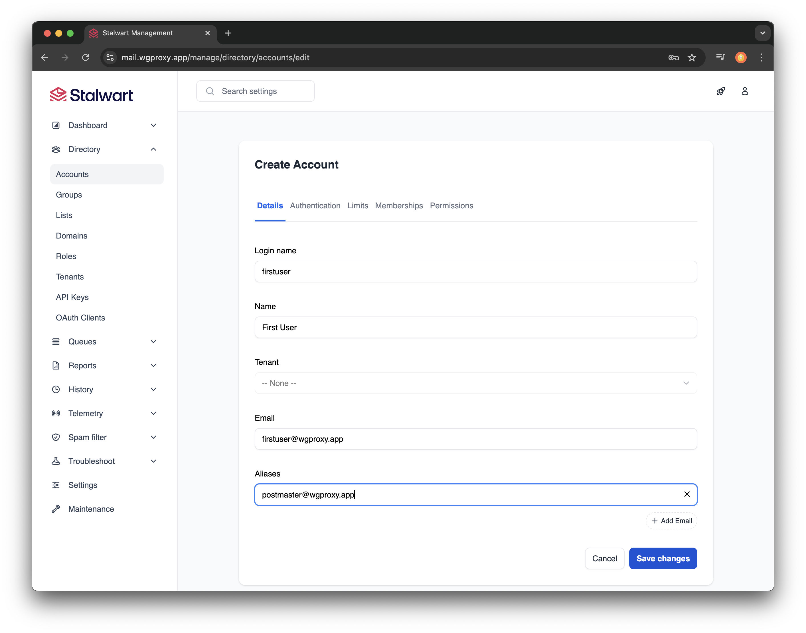
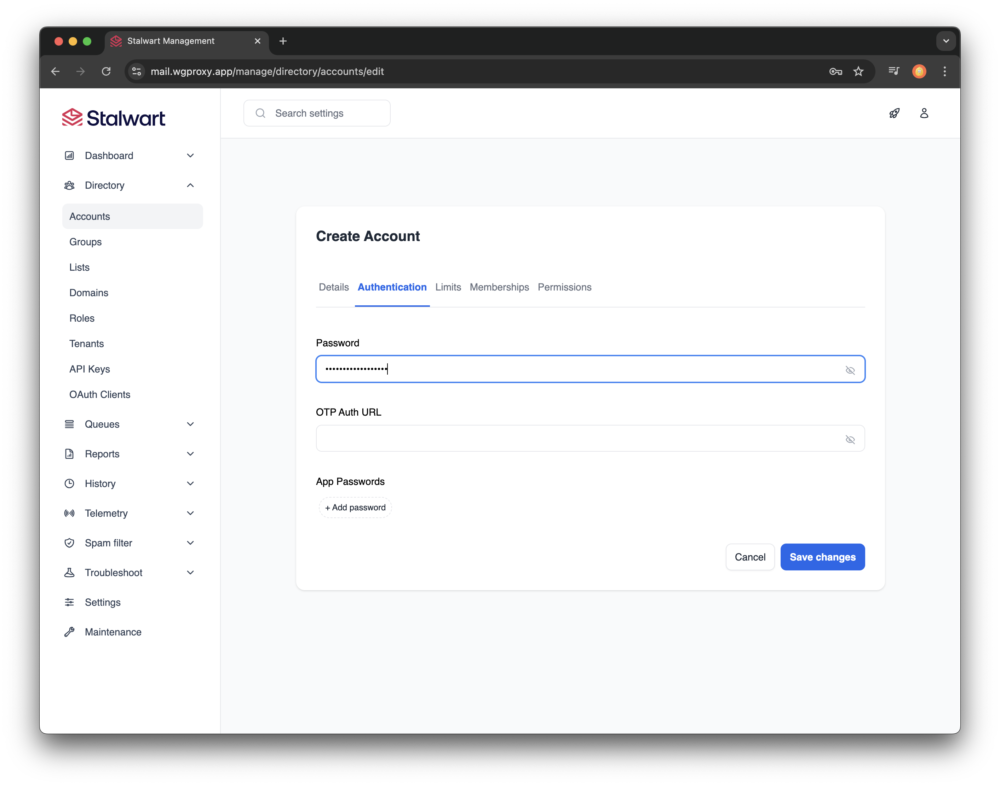
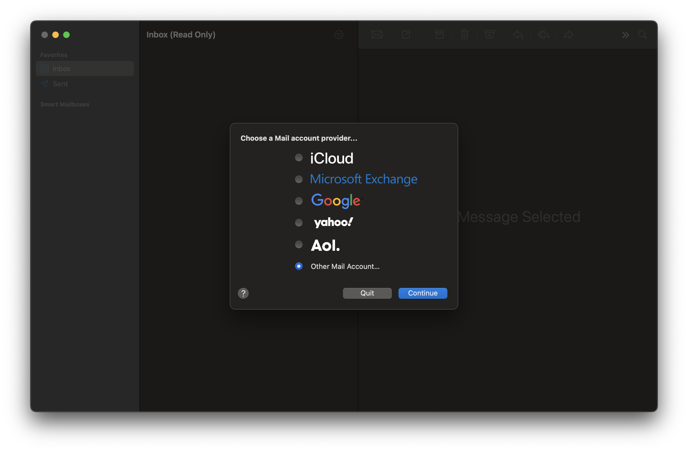
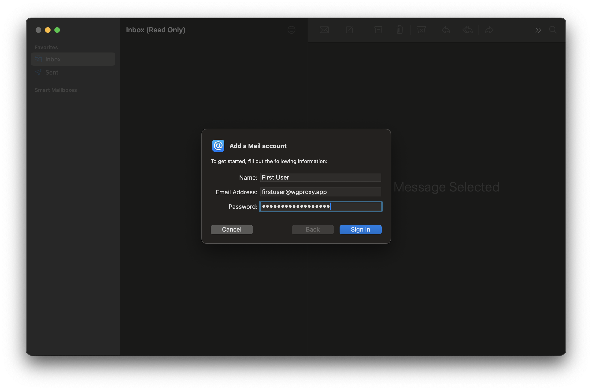
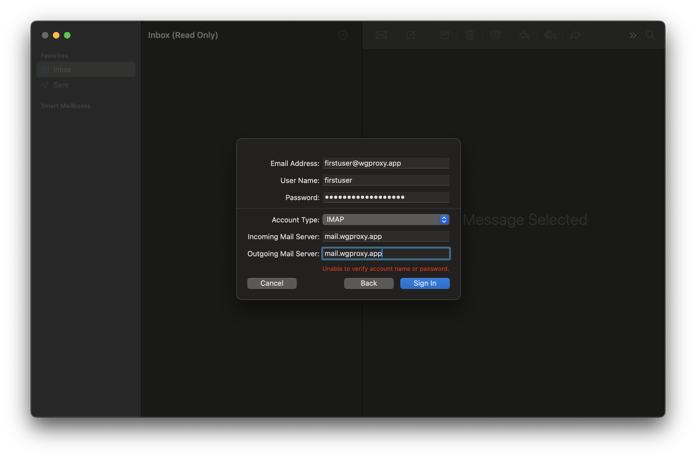
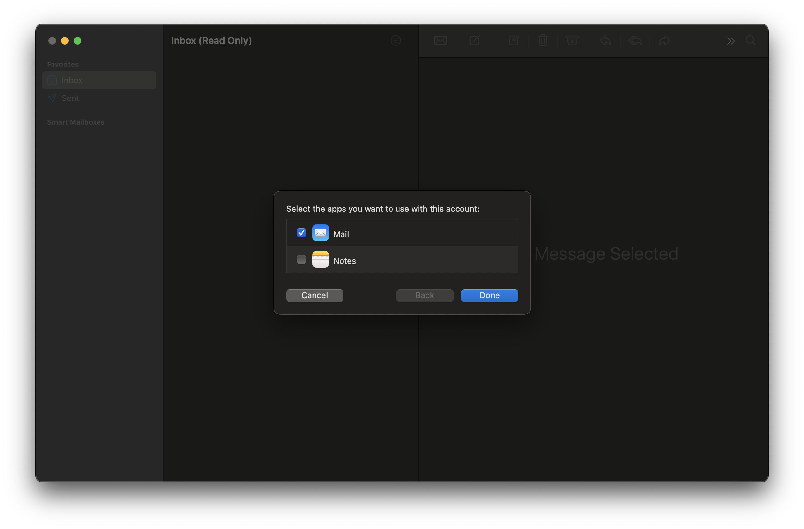
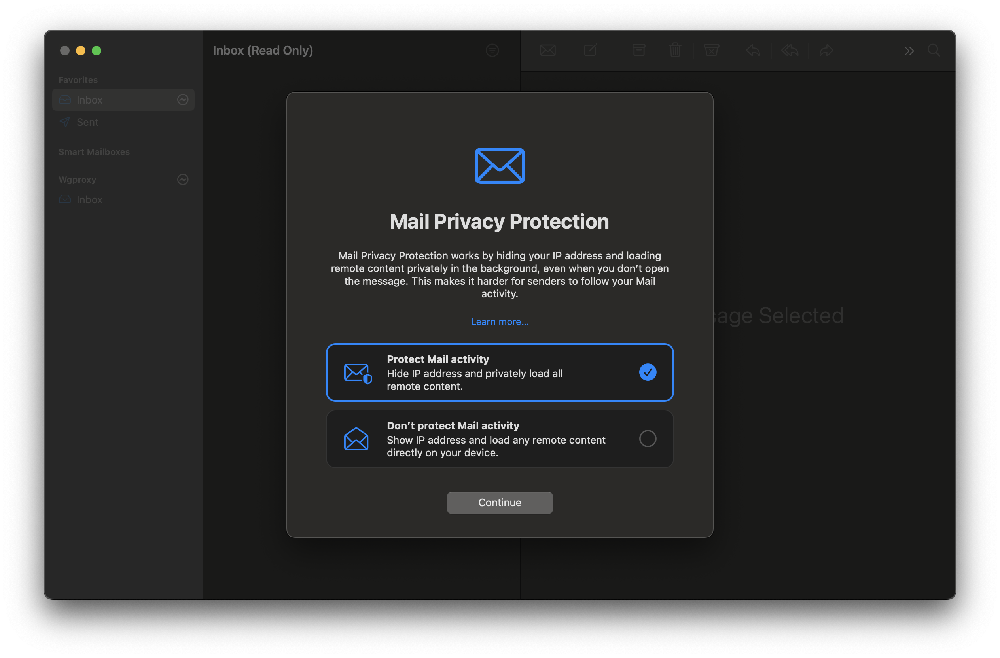

# Step 7 - Configure Stalwart

Congratulations, you can now configure your mail server! Use a browser to access the Stalwart login page. `https://<YOUR DOMAIN>`. You will receive an error about the self-signed certificate used on initial startup. You will fix that by setting up a proper domain.

The official site covers the initial configuration of the application.

* [Logging in to the web interface](https://stalw.art/docs/install/platform/docker#log-in-to-the-web-interface)
* [Configure your hostname and domain](https://stalw.art/docs/install/platform/docker#configure-your-hostname-and-domain)
* [Enable TLS](https://stalw.art/docs/install/platform/docker#enable-tls)

For a simple installation handling email for only my family and associated businesses using the default settings for storage and auth (RocksDB and internal authentication) has worked well.

From their docs:
>Stalwart Mail Server offers support for multiple database and storage backends. The choice of backend depends primarily on the scale and distribution of your mail server setup.
Detail  can be found [here](https://stalw.art/docs/install/docker/#configure-your-hostname-and-domain) and [here](https://stalw.art/docs/auth/backend/overview).

:::warning
Make sure you reload the configuration after setting the `settings` > `server` > `network` otherwise when you create the domain the DNS records will point to the internal Docker hostname of the container instead of the actual domain.

```zonefile title="Bad example"
@                  IN MX    10 e17b1f237a3a.
mail               IN CNAME e17b1f237a3a.
```

```zonefile title="Good example"
@                  IN MX    10 mail.<YOUR_DOMAIN>.
mail               IN CNAME mail.<YOUR_DOMAIN>.
```

:::

:::note
DNS entries you will be creating will be in the BIND zonefile we created earlier `/mnt/user/appdata/bind/lib/bind/db.<YOUR_DOMAIN>`

Be sure to increase your serial number!

import CodeBlock from '@theme/CodeBlock';

<CodeBlock language="c" title="foo">
$ORIGIN .
$TTL 3600       ; 1 hour
&lt;YOUR_DOMAIN&gt;             IN SOA  ns1.&lt;YOUR_DOMAIN&gt;. postmaster.&lt;YOUR_DOMAIN&gt;. (
&nbsp;                                 <span style={{ fontWeight: 'bold' }}>1970010101</span> ; serial
</CodeBlock>

Typically you use the format YYYYMMDD## format like:
<CodeBlock language="c" title="foo">
$ORIGIN .
$TTL 3600       ; 1 hour
&lt;YOUR_DOMAIN&gt;             IN SOA  ns1.&lt;YOUR_DOMAIN&gt;. postmaster.&lt;YOUR_DOMAIN&gt;. (
&nbsp;                                 <span style={{ fontWeight: 'bold' }}>2025071801</span> ; serial
</CodeBlock>

**Restart the BIND container in Unraid when done updating the zonefile.**
:::

:::warning
#### Self IP Block Issue
I ran into the [following issue](https://github.com/stalwartlabs/stalwart/issues/1383#issuecomment-2781973468) when I was building this document, but not when I built my original
installation. I was using Safari and could not load the Login page.

If you run into an issue where the Login page won't load and the logfile has entries with the remoteIP as the static reverse proxy public IP:

```txt title="/mnt/user/appdata/stalwart-data/logs/stalwart.log.YYY-MM-DD"
2025-03-20T21:43:36Z INFO Blocked IP address (security.ip-blocked) listenerId = "https", localPort = 443, remoteIp = ###.###.###.###, remotePort = 53085
2025-03-20T21:44:14Z INFO Blocked IP address (security.ip-blocked) listenerId = "https", localPort = 443, remoteIp = ###.###.###.###, remotePort = 53088
2025-03-20T21:44:14Z INFO Blocked IP address (security.ip-blocked) listenerId = "https", localPort = 443, remoteIp = ###.###.###.###, remotePort = 53089
2025-03-20T21:44:14Z INFO Blocked IP address (security.ip-blocked) listenerId = "https", localPort = 443, remoteIp = ###.###.###.###, remotePort = 53090
```

You can follow these steps to unblock the IP and prevent it from getting added:

1. Remove the IP from the block list
    1. From a console in the container, either obtained from the Unraid docker UI or executing `docker exec -it stalwart-mail bash`
    1. Using the correct PASSWORD run:

        ```bash
        apt-get update && apt-get -y install curl
        curl -u 'admin:PASSWORD' \
          --header 'Content-Type: application/json' \
          --data '[{"type": "clear", "prefix": "server.blocked-ip."}]' \
          http://127.0.0.1:8080/api/settings
        ```

1. Stop the `stalwart-mail` docker container.
1. Add the following line to `/mnt/user/appdata/stalwart-data/etc/config.toml` where `###.###.###.###` is the blocked IP your trying to access the console from or the public reverse proxy IP.

    ```toml title="config.toml"
    server.allowed-ip.###.###.###.### = ""
    ```

1. Start the `stalwart-mail` docker container.

:::

## Setup initial user

Once the domain and network are configured and verified it is time to create user accounts.

Navigate to: `Management` > `Directory` > `Accounts` > `Create a new account` to create your first account as assign the postmaster alias.

Assign a password to the user:


## Setup email client

Stalwart does not supply a web mail client. The configurations are set to allow any IMAP client to connect over ports 993 for IMAPS (Secure IMAP) using SSL/TLS encryption, and ports 465 and 587 for secure SMTP Submission requiring authentication and supporting TLS encryption for secure email transmission.

<details>
  <summary>
  MacOS Mail example:
  </summary>





</details>
