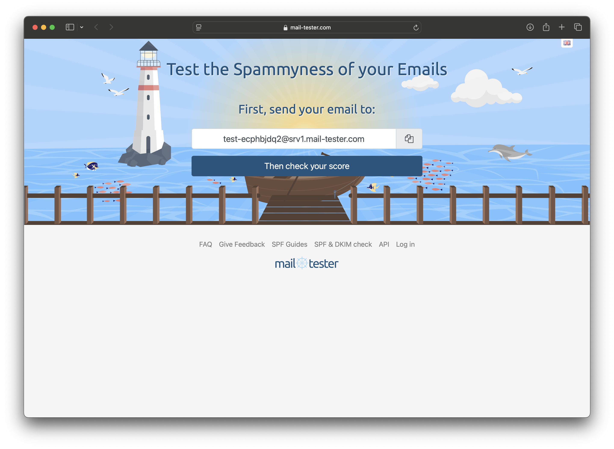

# Step 8 - Test sending and receiving

To test that everything is working as it should we can test mail sending and receiving using a number of online tools.

## Test email sending

To test sending email use [Mail Tester](https://www.mail-tester.com/). The site will give you an email address to send to and will evaluate how your email conforms to proper internet standards as well as spam testing.

Send an email to the randomized address:

Go back to the original web page and view your score. You should receive 10/10.

Viewing the email headers will show you the specifics of how the email was processed including DMARC and DKIM evaluations.

SpamAssassin will show you any misconfigurations which could identify your emails as spam.  In this example you can see that new domains will be penalized for the first 7 days.

## Test email reception

To test how emails are received on the server we use [CheckTLS Test Receiver](https://www.checktls.com/TestReceiver) which will show what email senders see when sending email to your address and confirm that the email is being received with encryption over TLS.

## Real-world test

You can now test sending to gmail and view the headers to validate proper functionality.

Congratulations you now have a self-hosted mail server!

## Further reading and help

If these tests fail we will need to debug what is not working. Check out the [debugging guide](debugging.md).

If there is a problem with the Stalwart configurations:

From the [GitHub repository](https://github.com/stalwartlabs/mail-server):
>If you are having problems running Stalwart Mail Server, you found
>a bug or just have a question, do not hesitate to reach us on
>[GitHub Discussions](https://github.com/stalwartlabs/mail-server/discussions), [Reddit](https://www.reddit.com/r/stalwartlabs) or [Discord](https://discord.gg/aVQr3jF8jd). Additionally you may
> purchase [premium support](https://stalw.art/support) to obtain priority support from Stalwart Labs LLC.
